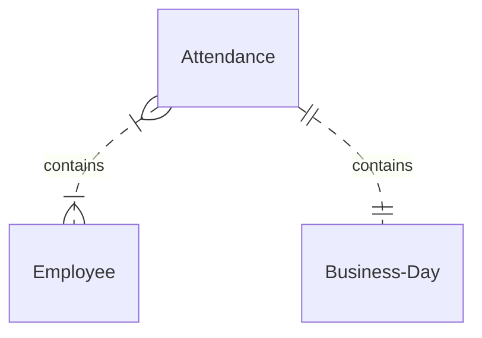

# shift-scheduler

## env

- jdk 17
- gradle 8.6

## model

## constraints

社員が出社して勤務する日にちを決定するためのに、スケジュール表を作成する。

スケジュール表は、以下の制約を満たして作成する必要がある。

|  #  |  制約種類  |  制約  |
| ---- | ---- |---- |
|  1  |  Hard |  1営業日に同一社員を複数カウントできない  |
|  2  |  Hard  | 同一営業日には、社員が2名以上出社する必要がある  |
|  3  |  Hard  | Fさんは足を怪我しているため、出社できない  |
|  4  |  Soft  | Aさんは子供の学校への送迎のため、月火水がいい  |
|  5  |  Soft  | Dさんは仕事の後飲みに行きたいので金曜日がいい  |
